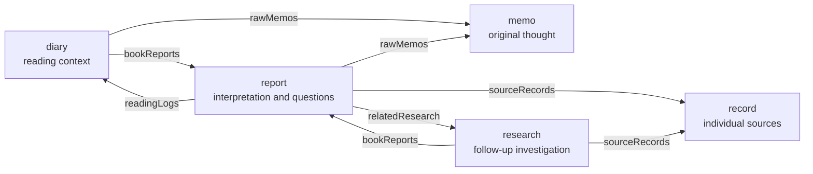
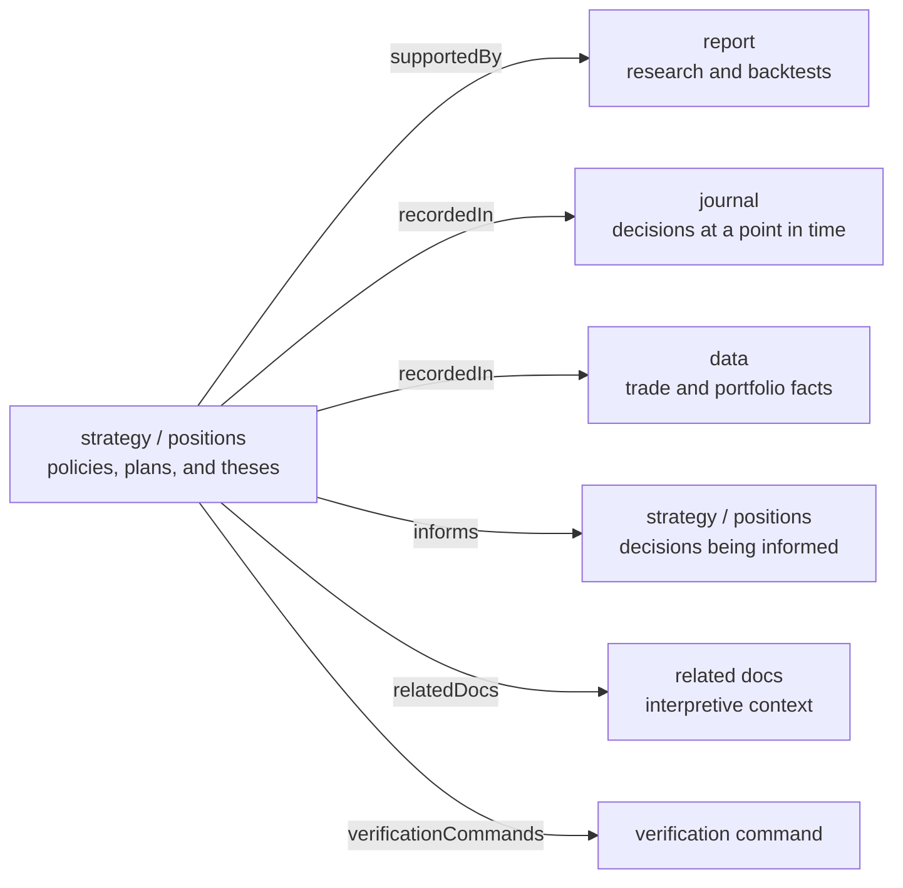
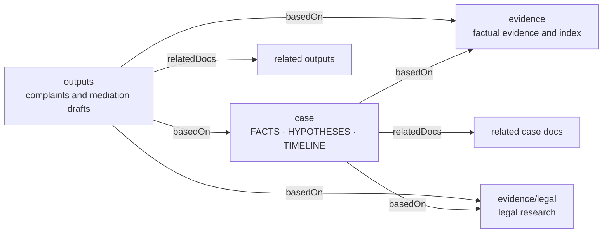

# Designing Project Memory Around Its Purpose

**Status:** DEV Community draft  
**Language:** [한국어](README.md)

A project's purpose determines the kinds of knowledge it needs and the relationships between them. Dotdotgod expresses that structure through memory areas and traceability keys. New knowledge connects to existing ideas and evidence, while missing relationships become research tasks and next actions.

A reading project needs to show how an idea develops into questions and research. An investment project needs to connect market interpretations to verification and action conditions. A dispute-resolution project needs to connect facts and evidence to the right institution and remedy.

Dotdotgod memory areas assign a role to each kind of project knowledge. Traceability keys record how that knowledge was created and where it is used. Each project therefore develops a vocabulary that reflects its own purpose.

## Connecting Ideas to Research in a Reading Project

`book` is a reading project that develops notes into personal interpretations and follow-up research. It keeps the reading experience, original notes, reports, external research, and source records together so an idea can be explored over time.

A first impression belongs in `memo`. The `diary` records when and where the thought emerged. A `report` develops interpretations and follow-up questions. When a question leads to external investigation, `research` holds that work, while `record` preserves individual sources and their access status.

The edge names are the actual traceability keys defined in `book/dotdotgod.config.json`. The reading diary uses `rawMemos` and `bookReports`. The report uses `readingLogs`, `rawMemos`, `relatedResearch`, and `sourceRecords`. The societal-response research links back to its report and source records through `bookReports` and `sourceRecords`.

The canonical files show this path in practice. `docs/memo/on-bullshit/ORIGINAL_NOTES.md` preserves an early intuition about fact-checking. `docs/report/on-bullshit/README.md` develops that intuition into research questions. `docs/research/on-bullshit/societal-response/` separates effects on factual belief, attitudes, sharing, and voting. `docs/record/on-bullshit/` preserves the sources and their access status.

These connections expanded one question into several outcomes and research areas. A claim without a linked source became a research task. Keeping the original thought beside the research result also made the reason for a changed interpretation visible.

## Connecting Interpretation to Action in an Investment Project

`stock` records and evaluates personal investment decisions. It connects market interpretations, backtests, position theses, decisions at a particular moment, and actual trade records to maintain current action conditions and risk rules.

Research and backtests live in `report`. Reusable portfolio policies and risk rules belong to `strategy`. The `positions` area holds security-specific theses and invalidation conditions. The `journal` preserves decisions and actions at a point in time, while `data` records trading and portfolio facts.

The edge names come directly from `stock/dotdotgod.config.json`. Traceability is required for `docs/strategy/**` and `docs/positions/**`. Those documents identify supporting research through `supportedBy`, journals and trading data through `recordedIn`, affected plans and positions through `informs`, interpretive context through `relatedDocs`, and executable checks through `verificationCommands`.

`docs/report/market-systems/PANIC_SELL_SHORT_COVER_BACKTEST_RESULTS_2026_08_01.md` records a base strategy with a 63.16% win rate and negative expectancy. A stricter variant with a small sample remains exploratory. The result leads to withheld deployment and further verification.

Win rate, expectancy, drawdown, sample size, and transaction costs become distinct decision inputs within the connected memory. A market interpretation develops into explicit verification results, risk rules, and action conditions.

## Connecting a Case to Resolution Paths

`roof-claim-now` organizes a dispute involving a shared rooftop and access for leak-repair work. It connects personal accounts, building records, contractor documents, legal research, and institution-specific filings to maintain the established facts and next actions.

The `case` area holds facts, hypotheses, open questions, and the timeline. `evidence` records what each source supports and the limits of that support. Legal research lives under the same evidence area. `outputs` contains complaints and mediation drafts, while `plan` holds active investigation and drafting work.

Inside the documents, `F` identifies a fact, `H` a hypothesis, and `I` an inquiry. `E` identifies factual evidence, `L` legal grounds, and `O` an external output.

The edge names are the actual keys in `roof-claim-now/dotdotgod.config.json`. Traceability is required for `docs/case/**` and `docs/outputs/**`. Case records and outputs use `basedOn` to identify canonical case records, evidence, and legal research. They use `relatedDocs` for other records and institution-specific outputs that should be interpreted together. The `F/H/I/E/L/O` identifiers form a separate item-level vocabulary inside those documents.

The connected memory divided the dispute into shared-space use, repair access, leak causation, structural load, drainage, waterproofing, administrative authority, civil remedies, and future operating procedures. The same factual base could then support different questions for administrative review, civil relief, and mediation.

## Relationships Produce Next Actions

In the reading project, a missing relationship between a question and research creates a research topic; a claim without a source calls for primary-source review. In the investment project, a gap between an interpretation and verification calls for a backtest; conflicting execution records call for ledger reconciliation. In the dispute project, a gap between a fact and evidence calls for another document; an unresolved question about authority calls for institutional or expert review.

Dotdotgod config defines the role of each memory area and names traceability relationships in the project's language. Validation finds structural omissions, while query provides routes from natural-language questions to relevant memory. New results connect to existing knowledge, and missing links drive further research and action.

The reading project connects notes to questions and research. The investment project connects interpretations to verification and action conditions. The dispute project connects facts and evidence to institution-specific resolution paths. Purpose-shaped memory shows both where knowledge currently lives and where it needs to move next.

[Connected Memory Expands Our Sense of a Project](../how-connected-memory-expands-project-cognition/ENGLISH.md) continues with how these structures developed better questions, judgment criteria, and next actions.
