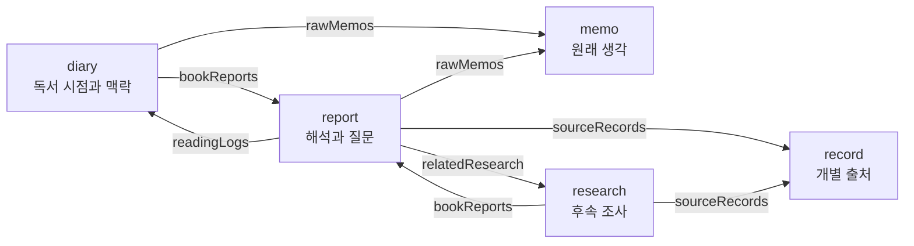
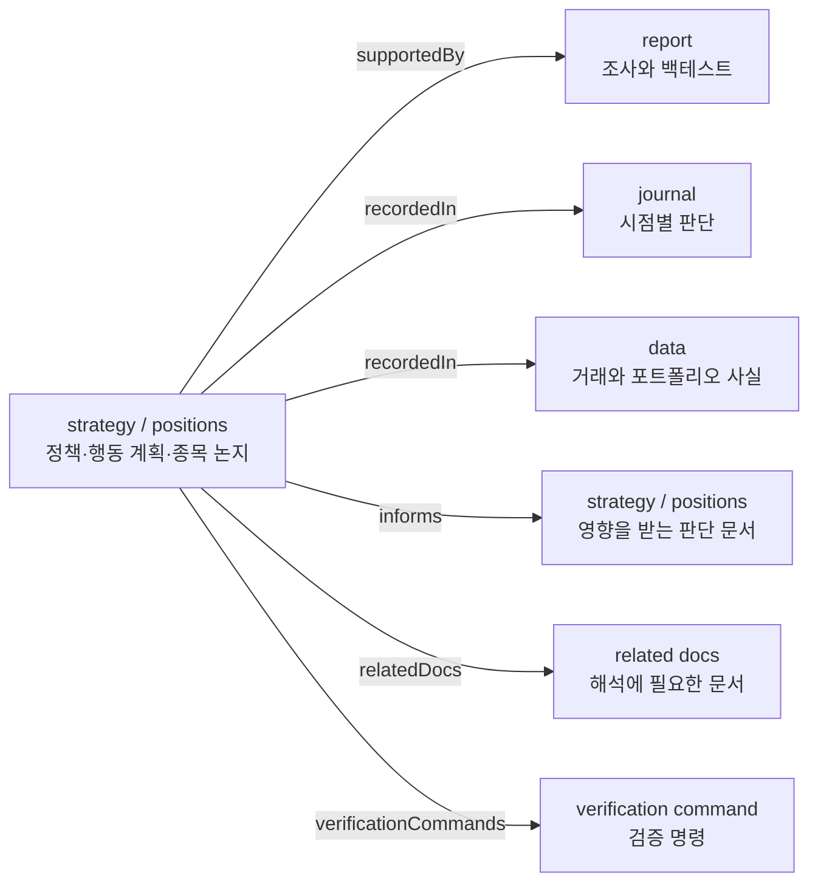
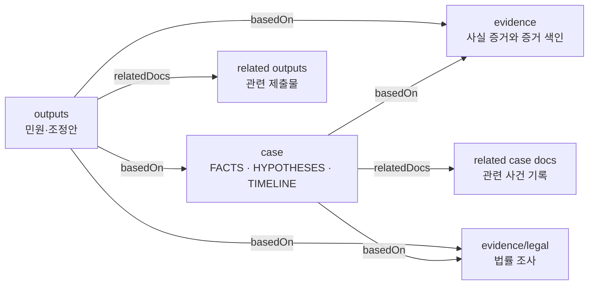

# 프로젝트의 목적에 맞게 메모리를 설계한다

**Status:** Velog 초안  
**Language:** [English edition](ENGLISH.md)

프로젝트의 목적은 필요한 지식의 종류와 관계를 결정한다. 닷닷갓은 이 구조를 메모리 영역과 트레이서빌리티 관계로 표현한다. 새로운 지식은 기존 생각과 근거에 연결되고, 관계가 비어 있는 곳은 다음 조사와 행동이 된다.

독서 프로젝트에서는 생각이 어떤 질문과 연구로 발전했는지가 중요하다. 투자 프로젝트에서는 시장에 대한 해석이 어떤 검증을 거쳐 행동 조건으로 이어졌는지를 확인해야 한다. 분쟁 프로젝트에서는 사실과 증거를 연결하고 적절한 기관과 해결 수단을 찾아야 한다.

닷닷갓의 메모리 영역 설정은 프로젝트에서 다루는 지식의 역할을 명시한다. 트레이서빌리티 설정은 그 지식이 만들어지고 사용되는 경로를 연결한다. 프로젝트마다 목적이 달라지므로 메모리 영역과 관계도 각자의 언어로 구성된다.

## 독서 프로젝트에서 생각과 연구를 연결했다

`book`은 책을 읽으며 남긴 메모를 개인적인 해석과 후속 연구로 발전시키는 독서 프로젝트다. 한 권의 책에서 시작한 생각을 장기간 탐구할 수 있도록 독서 경험, 원래 메모, 보고서, 외부 조사와 출처를 함께 관리한다.

처음 떠오른 생각은 `memo`에 남긴다. `diary`는 생각이 생긴 시점과 맥락을 기록하고, `report`는 책에 대한 해석과 후속 질문을 정리한다. 질문이 외부 조사로 발전하면 `research`가 그 과정을 맡고, `record`는 조사에 사용한 출처와 접근 상태를 보존한다.

간선 이름은 `book/dotdotgod.config.json`에 정의된 실제 트레이서빌리티 키다. 현재 문서의 canonical 블록에서 독서 일지는 `rawMemos`와 `bookReports`를 사용하고, 책 보고서는 `readingLogs`, `rawMemos`, `relatedResearch`와 `sourceRecords`를 사용한다. 사회적 대응 연구는 `bookReports`와 `sourceRecords`로 보고서와 출처 기록을 연결한다.

독서 일지는 원래 메모와 책 보고서를 가리킨다. 보고서는 자신이 출발한 메모와 후속 연구를 연결한다. 연구 문서는 조사에 사용한 개별 출처 기록으로 이어진다. 이 관계를 따라가면 독서 경험에서 시작한 생각이 질문과 연구, 출처와 수정된 해석으로 발전한 과정을 읽을 수 있다.

`docs/memo/on-bullshit/ORIGINAL_NOTES.md`에는 팩트체크의 역할에 관한 초기 직관이 남아 있다. `docs/report/on-bullshit/README.md`는 그 직관을 연구 질문으로 발전시킨다. `docs/research/on-bullshit/societal-response/`는 효과를 사실 인식, 태도, 공유와 투표로 나눠 조사한다. `docs/record/on-bullshit/`은 조사에 사용한 출처와 접근 상태를 보존한다.

메모리의 연결은 하나의 질문을 여러 결과변수와 연구 영역으로 펼쳤다. 출처가 연결되지 않은 주장은 추가 조사 대상으로 드러났다. 생각의 출발점과 조사 결과가 함께 남으면서 해석이 바뀐 이유도 확인할 수 있게 됐다.

## 투자 프로젝트에서 해석과 행동을 연결했다

`stock`은 개인의 투자 판단을 기록하고 검증하는 프로젝트다. 시장에 대한 해석, 백테스트, 종목별 투자 논지, 당시의 행동과 실제 거래 기록을 연결해 현재의 투자 조건과 위험 규칙을 관리한다.

시장 조사와 백테스트는 `report`에 기록한다. 반복해서 사용할 정책과 위험 규칙은 `strategy`가 담당한다. `positions`는 종목별 투자 논지와 훼손 조건을 관리하고, `journal`은 특정 시점의 판단과 행동을 남긴다. 실제 거래와 시장에 관한 확인 사실은 `data`가 보존한다.

간선 이름은 `stock/dotdotgod.config.json`에 정의된 실제 트레이서빌리티 키다. 트레이서빌리티가 필수인 `docs/strategy/**`와 `docs/positions/**` 문서는 자신을 뒷받침하는 조사와 데이터에 `supportedBy`와 `recordedIn`으로 연결된다. 이 문서가 영향을 주는 현재 행동 계획과 포지션은 `informs`에 기록되고, 해석에 필요한 문서와 검증 명령은 `relatedDocs`와 `verificationCommands`에 기록된다.

전략과 포지션 문서는 `supportedBy`에 조사 보고서를 기록하고 `recordedIn`에 일지와 거래 데이터를 함께 기록한다. `informs`는 포트폴리오 정책과 위험 규칙이 현재 행동 계획과 종목별 판단에 미치는 경로를 보여준다. 이 연결을 따라 조사 결과, 당시 판단과 실제 거래 사실을 함께 검토할 수 있다.

`docs/report/market-systems/PANIC_SELL_SHORT_COVER_BACKTEST_RESULTS_2026_08_01.md`의 기본 전략은 63.16%의 승률과 음수 기대수익을 함께 기록한다. 표본이 작은 엄격 조건은 탐색적 결과로 분류됐다. 조사 결과는 전략 적용 보류와 추가 검증 과제로 이어졌다.

승률, 기대값, 최대 낙폭, 표본 수와 거래 비용이 각자의 문서 관계 안에서 판단 기준으로 사용됐다. 시장에 대한 해석은 검증 결과와 위험 규칙을 거쳐 실행 가능한 조건으로 구체화됐다.

## 분쟁 프로젝트에서 사건과 해결 경로를 연결했다

`roof-claim-now`는 공동주택 옥상과 누수 공사를 둘러싼 분쟁을 정리하고 해결 경로를 찾는 프로젝트다. 당사자의 경험, 건축 자료, 공사 기록, 법률 조사와 기관별 제출 문서를 연결해 현재 확인된 사실과 필요한 다음 조치를 관리한다.

사건의 사실, 가설, 미해결 질문과 연표는 `case`가 관리한다. `evidence`는 증거가 뒷받침하는 사실과 입증 범위를 기록한다. `legal`은 관련 법률과 판례의 적용 조건을 다루고, `outputs`는 민원과 조정안 같은 외부 제출물을 보존한다. 현재 진행하는 조사와 작성 작업은 `plan`에 남는다.

문서 안에서는 확인된 사실에 `F`, 가설에 `H`, 미해결 질문에 `I`를 부여했다. 사실 증거는 `E`, 법적 근거는 `L`, 외부 제출물은 `O`로 식별했다. 외부 제출물의 주장은 확인된 사실과 증거를 사용하고, 법적 근거의 적용 조건과 기관이 확인해야 할 질문을 함께 연결한다.

간선 이름은 `roof-claim-now/dotdotgod.config.json`에 정의된 실제 트레이서빌리티 키다. 트레이서빌리티가 필수인 `docs/case/**`와 `docs/outputs/**` 문서는 정본 사건 기록, 증거와 법률 조사에 `basedOn`으로 연결된다. 같은 사건을 해석하거나 다른 기관용 제출물과 함께 검토할 문서는 `relatedDocs`로 연결된다. `F`, `H`, `I`, `E`, `L`, `O`는 문서 내용에서 사실, 가설, 질문, 증거, 법적 근거와 외부 제출물을 식별하는 프로젝트 내부 항목 체계다.

공용 부분 사용과 공사 접근은 사용 관계와 민사적 구제의 질문으로 발전했다. 누수 원인, 구조 하중, 배수와 방수는 추가 자료와 전문가 판단이 필요한 영역으로 분리됐다. 행정기관의 권한이 필요한 사안은 기관이 조사할 질문으로 작성됐고, 향후 공사 절차는 조정안의 운영 규칙으로 발전했다.

같은 사실 기반이 기관별 질문과 외부 제출물로 연결되면서 사건의 해결 경로와 추가로 필요한 판단이 구체화됐다.

## 관계가 다음 행동을 만든다

독서 프로젝트에서 질문과 연구의 연결이 비어 있으면 조사 주제가 생기고, 핵심 주장에 출처가 연결되지 않으면 원문 확인이 다음 작업이 된다. 투자 프로젝트에서 해석과 검증의 연결이 비어 있으면 백테스트가 필요하며, 실행 기록과 거래 데이터가 충돌하면 원장을 대조한다. 분쟁 프로젝트에서 사실과 증거의 연결이 부족하면 자료를 확보하고, 법률의 적용 조건과 기관의 권한이 비어 있으면 관할 기관과 전문가에게 확인한다.

닷닷갓 설정은 메모리 영역의 역할과 트레이서빌리티 관계를 프로젝트의 언어로 정의한다. validation은 구조의 누락을 찾고, query는 자연어 질문에서 관련 메모리로 이동하는 경로를 제공한다. 새롭게 얻은 결과는 기존 지식에 연결되고, 연결을 기다리는 부분은 조사와 행동으로 이어진다.

독서 프로젝트는 메모를 질문과 연구로 연결했다. 투자 프로젝트는 해석을 검증과 행동 조건으로 연결했다. 분쟁 프로젝트는 사실과 증거를 기관별 해결 경로로 연결했다. 목적에 맞게 설계된 메모리는 지식의 현재 위치와 다음 이동 경로를 함께 보여준다.

[연결된 메모리는 프로젝트를 이해하는 감각을 확장한다](../how-connected-memory-expands-project-cognition/README.md)에서 이 구조가 질문의 해상도와 판단 기준을 어떻게 발전시켰는지 이어서 살펴본다.
